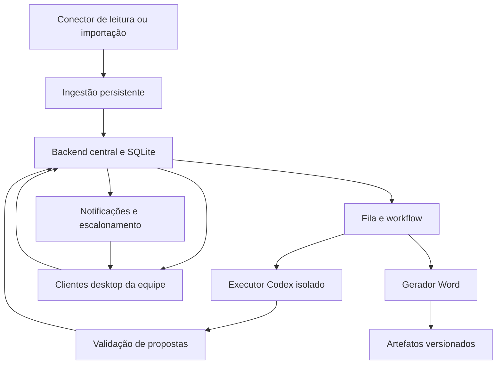

# Arquitetura consolidada — versão 1.0
Nome do projeto: Codex WhatsApp Task Router.

## Resultado desejado
Toda demanda capturada deve ter evidência, projeto, responsável ou fila de triagem, prazo ou pendência de definição, e próximo passo. O sistema acompanha aceite e conclusão, escalando omissões. Não promete ausência absoluta de atrasos nem captura de histórico indisponível.

## Mapa de documentos
| Documento | Conteúdo |
|---|---|
| PRODUTO.md | Escopo, atores, telas, jornada e produção |
| TOPOLOGIA.md | Servidor central, clientes, rede, processos e ambientes |
| DADOS.md | Modelo lógico completo e migrações |
| FLUXOS.md | Ingestão, tarefas, revisão, filas e escalonamento |
| CODEX_E_SKILLS.md | Integração de IA, execução e conteúdo de marketing |
| WHATSAPP.md | Conector de leitura, grupos, histórico, cobertura |
| SEGURANCA.md | Identidade, autorização, isolamento, arquivos e privacidade |
| API.md | Rotas existentes e contratos planejados |
| OPERACAO.md | Windows, disponibilidade, métricas, atualização, backup |
| TESTES.md | Gates e cenários de aceite |
| ROADMAP.md | Prioridades e limites públicos |
| RASTREABILIDADE.md | Cobertura do documento original e mudanças de escopo |
| FONTES.md | Referências primárias a revalidar |

## Componentes

O conector não oferece envio. O processamento de IA e anexos não bloqueia ingestão. A UI não executa SQL. Apenas backend central acessa banco ativo. Workers recebem pacotes restritos e retornam resultados; não acessam diretamente banco ou WhatsApp. Arquivos finais têm cópia canônica central e cópias locais identificadas por hash/versão.

## Invariantes
1. Demanda sem responsável vai para triagem monitorada.
2. Notificação entregue, visualizada, tarefa assumida e tarefa concluída são eventos diferentes.
3. Conclusão exige evidência de execução; envio manual é confirmação humana ou evento observado.
4. Importação histórica não dispara ações automaticamente.
5. Análise e produção usam snapshots; alteração relevante invalida derivados.
6. Ninguém obtém acesso a projeto apenas porque a IA citou seu nome.
7. Nenhum documento aprovado é sobrescrito.
8. Não há fallback pago nem promessa de quota infinita.
9. Falha de conector aparece como lacuna de cobertura, não como ausência de pedidos.
10. A operação manual funciona durante indisponibilidade da IA.

## Limite da entrega atual
A implementação é uma fatia demonstrativa do desenho. O código, a suíte automatizada e o roadmap público são a autoridade sobre o que existe; a presença de uma descrição ou schema não significa que o recurso esteja implementado.
